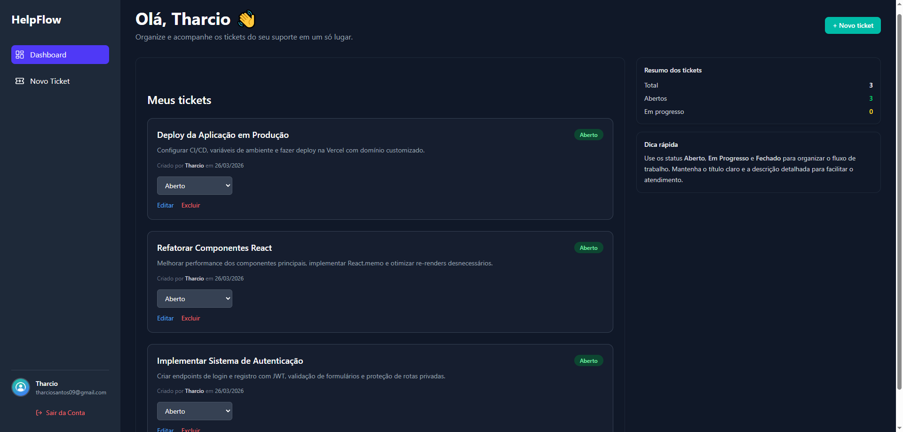

# 🚀 HelpFlow: Sistema de HelpDesk Completo

 
## 🌟 Visão Geral

O HelpFlow é uma aplicação web Full-Stack robusta de sistema de HelpDesk (chamados), projetada para simplificar a comunicação e o gerenciamento de solicitações entre clientes e equipes de suporte (agentes). Desenvolvido com tecnologias modernas, o HelpFlow oferece uma solução eficiente e segura para o acompanhamento de problemas e tarefas.

Este projeto demonstra habilidades sólidas em desenvolvimento Full-Stack, gerenciamento de banco de dados, autenticação e autorização baseada em papéis.

**[➡️ Acesse a versão ao vivo aqui!](https://helpflow.vercel.app/)** 

---

## ✨ Funcionalidades Principais

* **Autenticação Dual:** Login de usuários via **email/senha** ou **GitHub OAuth**, oferecendo flexibilidade e segurança.
  * **Email/Senha:** Sistema completo de registro e autenticação com criptografia bcrypt.
  * **GitHub OAuth:** Autenticação rápida usando conta do GitHub.
* **Gerenciamento de Usuários:** Distinção entre dois tipos de usuários:
* **Clientes:** Podem criar novos tickets e visualizar apenas os seus próprios tickets.
* **Agentes:** Possuem acesso a todos os tickets, podendo visualizar detalhes, atualizar o status (Aberto, Em Progresso, Fechado) e deletar tickets.
* **Criação de Tickets:** Clientes podem abrir novos chamados de forma intuitiva, fornecendo título e descrição detalhada do problema.
* **Dashboard Interativo:** Visão geral dos tickets, com listagem dinâmica e exibição do status atual (atualização em tempo real após criação).
* **Detalhes do Ticket:** Página dedicada para cada ticket, mostrando informações completas e opções de gerenciamento para agentes.
* **API RESTful:** Backend eficiente para todas as operações CRUD (Create, Read, Update, Delete) de tickets.

---

## 👥 Papéis de Usuário (Roles)

O sistema implementa uma lógica de autorização baseada em dois papéis:

* **`CLIENT` (Cliente):**
    * Papel padrão para **todos os novos usuários** que se cadastram (email/senha ou GitHub).
    * Pode criar novos tickets.
    * Pode visualizar apenas os tickets que criou.
* **`AGENT` (Agente):**
    * **Atribuição:** Atualmente, a promoção de um usuário para `AGENT` é feita **manualmente** pelo administrador diretamente no banco de dados (Supabase).
    * Pode visualizar **todos** os tickets de todos os clientes.
    * Pode atualizar o status (`Aberto`, `Em Progresso`, `Fechado`) de qualquer ticket.
    * Pode deletar qualquer ticket.

---

## 🛠️ Tecnologias Utilizadas

* **Framework:** [Next.js](https://nextjs.org/) (App Router) - Para o desenvolvimento Full-Stack, renderização de componentes e API Routes.
* **Linguagem:** JavaScript
* **Estilização:** [Tailwind CSS](https://tailwindcss.com/) - Para um design responsivo e moderno.
* **Autenticação:** [NextAuth.js](https://next-auth.js.org/) - Sistema completo de autenticação com CredentialsProvider e OAuth (GitHub).
* **Segurança:** [bcryptjs](https://www.npmjs.com/package/bcryptjs) - Hash seguro de senhas para autenticação.
* **ORM:** [Prisma](https://www.prisma.io/) - Gerenciamento de banco de dados, modelagem e consultas.
* **Banco de Dados:** [Supabase](https://supabase.com/) (PostgreSQL) - Backend como serviço (BaaS), com banco de dados gerenciado.

[](https://skillicons.dev)

---


## 🚀 Como Rodar Localmente

Para configurar e executar o HelpFlow no seu ambiente de desenvolvimento:

1.  **Clone o repositório:**
    ```bash
    git clone [https://github.com/tharcio09/helpflow.git](https://github.com/tharcio09/helpflow.git)
    cd helpflow
    ```

2.  **Siga as instruções detalhadas de configuração:**
    Consulte o arquivo [`DEVELOPMENT.md`](./DEVELOPMENT.md) na raiz do projeto para obter informações sobre variáveis de ambiente (`.env`), configuração do Supabase, GitHub OAuth e como iniciar o servidor.

---

## 📫 Contato

**Tharcio Santos**

* [LinkedIn](https://www.linkedin.com/in/tharcio-santos/)
* [Email](tharciosantos09@gmail.com)
