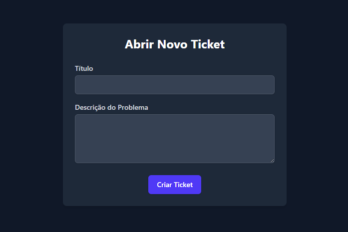
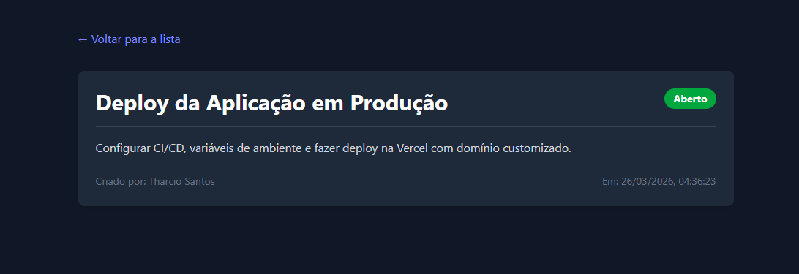
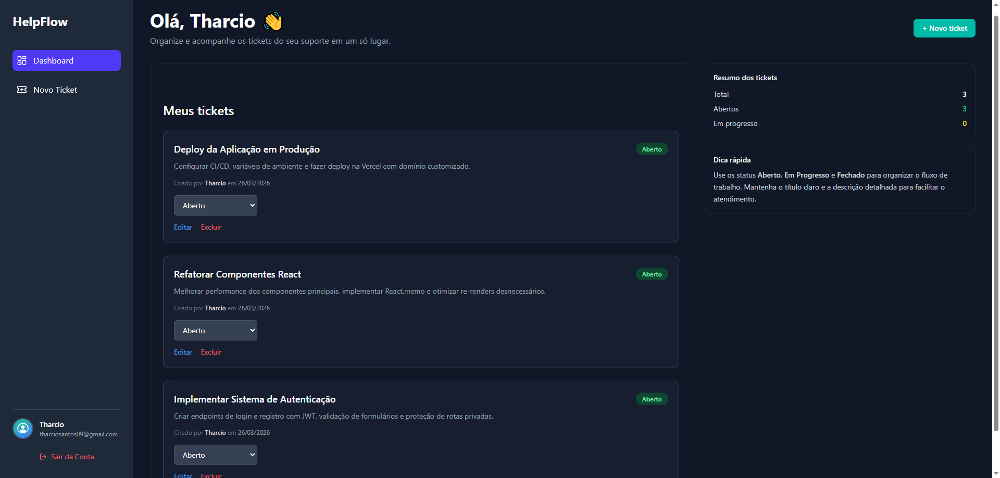

# HelpFlow

Sistema de help desk full-stack com autenticação híbrida, RBAC e gestão de tickets construído com Next.js, Prisma e PostgreSQL.

## Visão Geral

O HelpFlow foi pensado para centralizar a abertura, o acompanhamento e a atualização de chamados em uma interface simples. A aplicação combina autenticação por credenciais e GitHub OAuth, com autorização aplicada no servidor para proteger rotas e operações sensíveis.

Aplicação em produção: [helpflow.vercel.app](https://helpflow.vercel.app/)

## Preview

### Criação de ticket


### Detalhes do ticket


### Dashboard


## Funcionalidades

- Autenticação com email e senha usando `bcryptjs`
- Login social com GitHub via `next-auth`
- Controle de acesso por papel com distinção entre `CLIENT` e `AGENT`
- Criação, edição, atualização de status e exclusão de tickets
- Dashboard com listagem, resumo de status e fluxo básico de atendimento
- Persistência com Prisma e PostgreSQL

## Regras de acesso

- `CLIENT` cria tickets, visualiza os próprios chamados e pode editar ou remover os tickets que abriu
- `AGENT` visualiza todos os tickets e pode editar, atualizar status e excluir qualquer chamado
- A autorização é validada nas rotas da API com base em `role` e `ownership`; a interface apenas reflete essas permissões

## Stack

- `Next.js 15` com App Router
- `React 19`
- `Tailwind CSS 4`
- `NextAuth.js`
- `Prisma`
- `PostgreSQL`
- `Vercel`

## Estrutura do projeto

```text
src/
  app/
    (auth)/           telas de login e cadastro
    (dashboard)/      dashboard, criação e edição de tickets
    api/              autenticação, cadastro, tickets, health e keep-alive
    components/       componentes reutilizáveis da interface
  lib/
    prisma.js         cliente Prisma singleton
prisma/
  schema.prisma       modelos e enums do banco
public/
  *.PNG               imagens usadas no README
```

## Como rodar localmente

### 1. Clone o repositório

```bash
git clone https://github.com/tharcio09/helpflow.git
cd helpflow
```

### 2. Instale as dependências

```bash
npm install
```

### 3. Configure o ambiente

Crie o arquivo `.env` a partir de `.env.example`:

```bash
cp .env.example .env
```

Preencha as variáveis:

```env
AUTH_GITHUB_ID=
AUTH_GITHUB_SECRET=
NEXTAUTH_URL=http://localhost:3000
NEXTAUTH_SECRET=
DATABASE_URL=
DIRECT_URL=
```

### 4. Prepare o banco

Para ambiente local, o fluxo mais alinhado com o estado atual do projeto é:

```bash
npx prisma db push
npx prisma generate
```

### 5. Inicie a aplicação

```bash
npm run dev
```

Aplicação local: [http://localhost:3000](http://localhost:3000)

## OAuth com GitHub

Configure uma OAuth App no GitHub com os callbacks:

- Local: `http://localhost:3000/api/auth/callback/github`
- Produção: `https://helpflow.vercel.app/api/auth/callback/github`

Se não quiser usar login social, basta deixar `AUTH_GITHUB_ID` e `AUTH_GITHUB_SECRET` vazios.

## Scripts

- `npm run dev` inicia o ambiente de desenvolvimento
- `npm run build` gera o build de produção
- `npm run start` sobe o build gerado
- `npm run lint` executa o ESLint

## Observações técnicas

- A sessão usa estratégia `jwt`, com `id` e `role` propagados para o token e para `session.user`
- O papel padrão criado no cadastro é `CLIENT`
- As rotas protegidas usam `getServerSession` para validar autenticação antes de acessar ou alterar tickets
- Existe uma rota de `health` e um endpoint de `keep-alive` para suporte operacional

## Documentação adicional

- Guia de desenvolvimento local: `DEVELOPMENT.md`

## Contato

Tharcio Santos  
[LinkedIn](https://www.linkedin.com/in/tharcio-santos/)  
[tharciosantos09@gmail.com](mailto:tharciosantos09@gmail.com)
